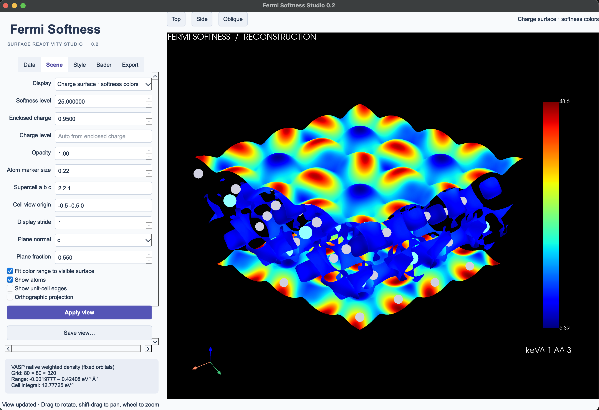
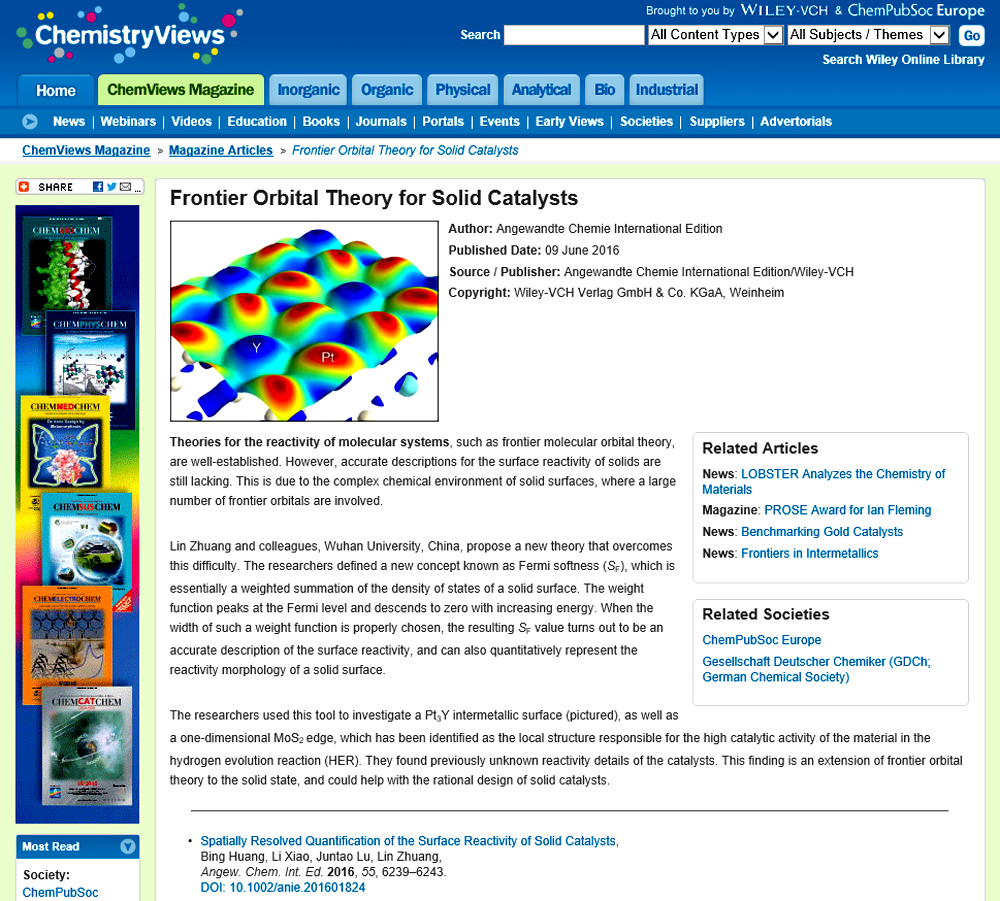

# Fermi Softness

**From VASP wavefunctions to spatial maps of surface reactivity.**

Fermi Softness implements the descriptor introduced by Huang, Xiao, Lu and
Zhuang, [Angew. Chem. Int. Ed. 55, 6239–6243 (2016)](https://doi.org/10.1002/anie.201601824).
It combines a streaming scientific Python engine, a command line interface,
and **Fermi Softness Studio**, a local desktop viewer.

> **Citation required for research use:** Users of this software or the
> Fermi-softness method in research, publications or scientific presentations must
> cite **Huang et al., Angew. Chem. Int. Ed. 2016, 55, 6239–6243**,
> [DOI: 10.1002/anie.201601824](https://doi.org/10.1002/anie.201601824).
> See [citation instructions and BibTeX](CITING.md). A software citation does not
> replace the original paper citation.

[中文首页与使用文档](docs/README.zh-CN.md) · [Complete user guide](docs/user-guide.en.md) ·
[All documentation](docs/index.md) · [CLI reference](docs/cli-reference.en.md)

[](docs/images/studio-overview.png)

*Fermi Softness Studio: the Pt₃Y(111) softness map and interactive scene controls.*

## Origins of Fermi softness

Huang, Xiao, Lu and Zhuang introduced Fermi softness in
[2016](https://doi.org/10.1002/anie.201601824), bringing a frontier-orbital
perspective to solid catalyst surfaces. By weighting electronic states near the
Fermi level, the method provides both a surface-reactivity descriptor and a
spatial map of local reactivity.

On **9 June 2016**, ChemistryViews featured the work in *Frontier Orbital Theory
for Solid Catalysts*, illustrating the Pt₃Y surface and discussing MoS₂ edges.
The historical screenshot below was supplied by Lin Zhuang. This toolkit brings
the method to VASP workflows with interactive visualization and atomic analysis.

[](docs/images/chemistryviews-2016.jpg)

*Historical coverage: ChemistryViews / Angewandte Chemie International Edition,
9 June 2016. Copyright credited in the screenshot: Wiley-VCH Verlag GmbH & Co.
KGaA, Weinheim. Click the image for the full-resolution screenshot.
[Image source and credits](THIRD_PARTY.md#historical-chemistryviews-screenshot).*

## Software overview

This is version **0.2.2**, a research release with colorbar styles, offline
surface demos, and integrated Bader analysis. The independent VASP
postprocessor is implemented; the optional Fortran component is an integration
kernel, not a certified patch to a specific VASP version.

Start with **Data → Open selected demo** to inspect Pt(111), Pt₃Y(111), or a
Bader-selected surface atom. Pt₃Y is a PW91 reconstruction with the paper's
display settings and shows the Pt-high/Y-low spatial contrast.

This release includes the standalone engine, GUI, CLI/Python interfaces, offline
demos, bilingual manuals and an independent Fortran kernel. Read the
[release notes](docs/release-0.2.2.md), [scientific conventions](docs/science.md)
and [validation record](docs/validation.md) for its exact scope.

## Install

Python 3.10 or newer. Clone the repository, or unpack a source release:

```sh
git clone https://github.com/zhuangl/Fermi_softness.git
cd Fermi_softness
```

From that source directory:

```sh
python -m venv .venv
# macOS / Linux
source .venv/bin/activate
# Windows PowerShell: .venv\Scripts\Activate.ps1
python -m pip install ".[gui]"
fermi-softness gui --demo
```

For a server or HPC installation without the viewer, use `pip install .`.
Install development tools with `pip install ".[gui,dev]"`.
These commands install from the local source; no PyPI publication is assumed.
On macOS, create the application icon once with:

```sh
fermi-softness install-app --open
```

Then open **Fermi Softness Studio** from Applications or Spotlight. For a
one-click source installation, double-click **Install Fermi Softness Studio.command**.
See [desktop setup](docs/desktop-app.md) for the application location and updates.
For wheel installation, graphics setup and troubleshooting, see the
[complete user guide](docs/user-guide.en.md).

```sh
fermi-softness demos
fermi-softness gui --example pt3y111
```

## Calculate your first map

Use **WAVECAR and vasprun.xml from the same converged static VASP calculation**.
A matching CHGCAR is optional, and is used for the charge-surface display.

```sh
fermi-softness inspect path/to/WAVECAR
fermi-softness compute \
  --wavecar path/to/WAVECAR \
  --vasprun path/to/vasprun.xml \
  --kt 0.4 -o my-softness
fermi-softness gui my-softness/softness.npz --charge path/to/CHGCAR
```

Or select both files in the Studio **Data** tab and click **Calculate softness**.
Calculations run in a background thread; the progress bar reports reconstructed
states and the Cancel button stops after the current state. Save the resulting
field from the **Export** tab.

The CLI produces:

- `softness.npz`: numerical grid, structure, units and provenance.
- `softness.cube`: interchange with VMD, VESTA and other volume viewers.
- `metadata.json`: settings, cutoff coverage, norms and integrated softness.
- `softness_up.npz` / `softness_down.npz` for collinear spin calculations.

Existing result directories are protected against accidental overwrite.

### Native VASP density route

For VASP's augmented charge-density representation, use the native partial-
density backend. It uses the same eigenstate weights, while VASP supplies the
per-state density including its augmentation treatment:

```sh
fermi-softness prepare-parchg --wavecar path/to/WAVECAR \
  --vasprun path/to/vasprun.xml --incar path/to/INCAR -o native-deck
# Copy the original WAVECAR and matching POTCAR into native-deck.
# Run your VASP executable there, using your usual scheduler.
fermi-softness compute-parchg native-deck/manifest.json -o native-softness
fermi-softness gui native-softness/softness.npz --charge path/to/CHGCAR
```

Studio exposes **Prepare native VASP densities** and **Combine native densities**
in the Data tab. The deck sets LPARD, separates both bands and k points, and uses
KPAR=1. It retains the original INCAR's other settings. The tool fingerprints
WAVECAR, verifies per-state integrals and combines spin channels correctly.
All prepared files must come from that deck; a sum over a whole energy window
cannot replace the state-resolved files. Gzipped PARCHG files are supported.

This route supports scalar and collinear spin calculations, since VASP LPARD
does not support spinors. Native charge augmentation is distinct from an
all-electron wavefunction reconstruction. It requires an additional VASP
postprocessing run and more disk space than direct WAVECAR reconstruction.

For nonmagnetic scalar calculations, a **compact fixed-orbital route** avoids
writing one file per state:

```sh
fermi-softness prepare-frozen --wavecar path/to/WAVECAR \
  --vasprun path/to/vasprun.xml --incar path/to/INCAR -o compact-deck
# Copy/link the original WAVECAR and matching POTCAR, then run the prepared VASP deck.
fermi-softness compute-frozen compact-deck/manifest.json -o native-softness
```

The importer checks the source, algorithm, eigenvalues, occupations and final
integral. This route has been checked against the explicit PARCHG sum on
VASP 6.4.2. See [native export](docs/native-export.md).

## Prepare VASP input

Start from a converged geometry and use a static calculation with these relevant
settings; choose the functional, cutoff, k mesh and convergence controls for
your system:

```text
NSW    = 0
IBRION = -1
LWAVE  = .TRUE.
LCHARG = .TRUE.
ISYM   = -1
PREC   = Accurate
LREAL  = .FALSE.
# Set NBANDS high enough to include the full softness energy window.
```

`ISYM=0` is also supported for scalar collinear states. General spatial symmetry
reconstruction is not included in this release. An ordinary `ISYM=2` calculation
must be rerun with the settings above for a quantitative local map.

For kT = 0.4 eV and the default absolute kernel threshold 0.001 eV⁻¹, the energy
window is about EF ± 3.13 eV. Empty bands matter: do not multiply contributions
by their ground-state occupation. The software checks window coverage and
refuses insufficient bands by default. Diagnostic overrides are available in
the CLI and are clearly marked in saved metadata and rendered images.

The nominal kT is a descriptor parameter; it is independent of VASP's SCF
`SIGMA`. kT = 0 is not evaluated by this finite-temperature algorithm.

## Explore and export

Studio offers three modes:

1. **Softness isosurface**: view the shape of a chosen reactivity level.
2. **Charge surface · softness colors**: map softness onto a charge-density
   surface, including the paper's 95% enclosed-charge criterion.
3. **Planar section**: inspect a plane perpendicular to a lattice direction.

Drag to rotate, shift-drag to pan, and use the wheel to zoom. Choose a colormap,
manual common color range, opacity, supercell repeats, or an orthographic view.
Save the view to JSON to restore the camera and numerical display parameters.
Automatic color scaling fits the visible surface; disable it when comparing
different materials on a common scale.

The **Style** tab offers scientific light, paper 2016, presentation dark and
grayscale presets. Select horizontal, vertical, compact, endpoint-only or
hidden colorbars, fonts, tick formatting, reversed palettes and eV/keV display
units. Numerical field values are unchanged by styling.

Export PNG or TIFF with an explicit pixel size and DPI, including transparent
backgrounds. Image resolution is independent of the numerical FFT grid.

```sh
fermi-softness render my-softness/softness.npz \
  --charge path/to/CHGCAR --scene view.json \
  --width 4800 --height 3600 --dpi 600 -o figure.png
```

Rendering needs a graphics context: a macOS desktop session, or a suitable
X/EGL/OSMesa setup on Linux. The calculation engine itself does not.

## Quantitative analysis

```python
from fermi_softness.compute import calculate
field, spin_channels = calculate("WAVECAR", "vasprun.xml", kt=0.4)
print(field.integral)                       # smooth field integral, eV^-1
print(field.metadata["spectral_softness_eV_inverse"])
values_at_sites = field.sample([[0.0, 0.0, 5.0]])  # Cartesian Angstrom
```

To integrate a Bader partition prepared by an external tool, supply integer
voxel labels with the same grid, lattice, origin and ordering:

```sh
fermi-softness integrate my-softness/softness.npz \
  --labels bader-labels.npy -o basins.json
```

Label 0 can represent vacuum. The tool does not infer Bader volumes from an
`ACF.dat` file and does not substitute geometric atom spheres for Bader basins.
The paper's surface descriptor is obtained by summing the first surface layer's
basins; the whole-cell integral is a different quantity.

Or generate the partition directly:

```sh
fermi-softness install-bader
fermi-softness bader my-softness/softness.npz \
  --reference AECCAR0 AECCAR2 --charge CHGCAR -o bader-results
```

The **Bader** tab provides atomic softness, volumes and valence populations,
plus selected-atom and surface-layer visualization. The actual Henkelman
near-grid algorithm defines the basins. See [Bader analysis](docs/bader.md).

## Representation and supported files

The field reconstructed directly from WAVECAR is the **smooth PAW pseudo-wavefunction
contribution**, in eV⁻¹ Å⁻³. Coefficients keep their original norms. The PAW
on-site augmentation is not included. Consequently the field's spatial integral
need not equal the full spectral softness. Both are reported. Refining the FFT
grid samples the same plane-wave function; it does not restore missing PAW
information or repair an unconverged DFT calculation.
The native LPARD backend includes VASP's charge augmentation and checks its
spatial integral against the spectral softness. Both routes record their
representation in the native result's metadata.

Implemented: scalar standard WAVECAR, collinear spin, Gamma half storage (x or
legacy z), noncollinear/spinor charge density, little/big endian, precision tags
45200/45210/53300/53310, skew cells, and gzip vasprun.xml metadata. Native
`vaspwave.h5` input is not implemented. Double precision is tested with generated
fixtures; see the validation matrix for real-file coverage.

## Reproduce the checks

```sh
python -m pytest -q
python validation/fetch_public_fixtures.py
python -m pytest -q tests/test_public_wavecars.py
python validation/compare_pymatgen.py   # optional reference: pip install pymatgen
python validation/gui_smoke.py         # desktop session, gui extra required
```

The synthetic tutorial has no electronic-structure claim:

```sh
fermi-softness demo -o demo
fermi-softness gui demo/softness.npz --charge demo/charge.npz
```

## Contribute and cite

See [CONTRIBUTING.md](CONTRIBUTING.md). Please cite the original method using
[CITATION.cff](CITATION.cff), and report the software version, kT, energy cutoff,
DFT convergence parameters, PAW representation and visualization scale.
The original software is distributed under BSD-3-Clause. VASP, POTCAR files and
the publisher's PDFs are not included in the public release.

The [developer guide](docs/developer-guide.en.md) documents the Python API,
archive formats, source layout and release checks. Bug reports and feature
requests can be submitted through the repository's Issues tab.
