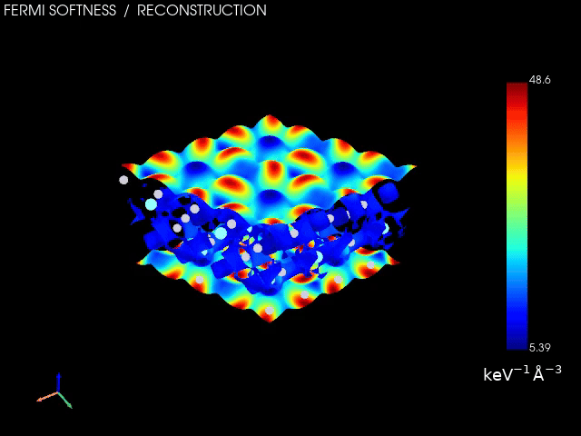

# Rotation and animation / 自动旋转与动画

[Documentation index / 文档目录](index.md)



Pt₃Y(111), one complete rotation with a fixed color scale. / Pt₃Y(111) 完整旋转一圈，
全程采用固定色标。[View settings / 视图参数](images/pt3y-turntable.gif.scene.json) ·
[Animation record / 动画记录](images/pt3y-turntable.gif.animation.json)

## English

Click **Auto rotate**, next to Top / Side / Oblique, to start a continuous
turntable. Click **Pause rotation** to stop. Choose the axis and preview speed
in degrees per second beside the button. Dragging the view manually, selecting
a fixed orientation, loading a scene or saving the view pauses rotation.

The default **Surface normal** is perpendicular to the cell's a–b plane. **View
up** rotates around the current camera's vertical direction; **X / Y / Z** are
Cartesian axes. The camera moves around its current focal point. Compose the
initial view; **Fit full rotation** is enabled by default to add enough space for
every angle. Turn it off if you want to retain the exact camera framing.

In **Export → Rotation animation**, choose:

| Setting | Default | Meaning |
|---|---|---|
| Width × Height | 1920 × 1080 | Actual movie pixels; dimensions must be even, 128–4096 |
| Duration | 12 s | Total movie length, 0.25–120 s |
| Frame rate | 30 fps | 1–60 frames/s |
| Full rotations | 1 | 1–10 complete turns during the selected duration |
| Reverse direction | Off | Reverse preview and export direction |
| Fit full rotation | On | Zoom out when needed to avoid clipping during the turn |

Select **Export animation (MP4 / GIF)…** and save to a new filename. Export
starts from the current view, using the axis selected in the toolbar. Movie
speed is determined by duration and full rotations; the toolbar speed controls
the interactive preview. A progress dialog allows cancellation. After export or
cancellation, the original camera and viewport size are restored.

**MP4** uses H.264 and is suitable for high-resolution presentations. **GIF**
loops continuously and uses a 256-color palette. Both keep the scene background,
legend and color limits throughout the turn; changing viewing angle does not
rescale the numerical colors. Transparency and DPI controls in the still-image
section apply to PNG/TIFF, not these movies.

Frames are streamed to the encoder. GIF generation uses a temporary video and a
separate palette pass, so the whole sequence is not held in memory. Temporary
files are removed on cancellation or failure; existing result files are preserved.
Keep sufficient free disk space for the temporary video and final animation.

Each export saves `movie.mp4.scene.json` and `movie.mp4.animation.json` (or GIF
equivalents). These record the starting camera including perspective field of
view, display settings, axis, duration, frame count and fixed numerical color
range. Keep the numerical field and charge input separately.

### Command line

```sh
fermi-softness animate softness.npz --charge CHGCAR --scene view.json \
  --axis normal --seconds 12 --fps 30 --turns 1 \
  --width 1920 --height 1080 -o rotation.mp4
```

Change the output extension to `.gif` for GIF, add `--reverse` to reverse the
turn, or `--no-fit` to keep the exact framing. A saved export's `.scene.json` can
be used as the next `--scene` input.
The GUI extra includes the FFmpeg dependency; it does not need a separate system
installation. As with still rendering, a working VTK graphics context is required.

## 中文

点击 Top / Side / Oblique 旁的 **Auto rotate** 开始自动旋转，再点击
**Pause rotation** 暂停。旁边可选择旋转轴和预览角速度（°/s）。手动拖动视图、切换
固定视角、加载场景或保存视图时，会暂停自动旋转。

默认 **Surface normal** 是晶胞 a–b 平面的法线；**View up** 是当前相机的竖直方向；
**X / Y / Z** 是笛卡尔坐标轴。相机围绕当前焦点转动，建议先调整构图，给结构在不同
角度下的显示留出空间。默认勾选 **Fit full rotation**，会按需缩小显示以容纳完整
旋转；取消勾选则保留精确构图。

在 **Export → Rotation animation** 中设置：

| 设置 | 默认值 | 含义 |
|---|---|---|
| Width × Height | 1920 × 1080 | 视频实际像素数；各维为 128–4096 的偶数 |
| Duration | 12 秒 | 动画总时长，可选 0.25–120 秒 |
| Frames / second | 30 fps | 帧率，可选 1–60 帧/秒 |
| Full rotations | 1 圈 | 在总时长内旋转 1–10 圈 |
| Reverse direction | 不勾选 | 反转预览和导出的旋转方向 |
| Fit full rotation | 勾选 | 按需缩小显示，避免旋转中结构被画框截断 |

点击 **Export animation (MP4 / GIF)…**，选择新的文件名保存。动画从当前视角开始，
采用上方工具栏选定的旋转轴。导出速度由“总时长”和“圈数”决定，工具栏的 °/s 用于
交互预览。导出过程显示进度，并可取消；结束或取消后会恢复原视角和窗口尺寸。

**MP4** 使用 H.264，适合高清演示；**GIF** 自动循环播放，采用 256 色调色板。
两种格式都保持当前背景、图例和色标范围，旋转时不会随角度重新缩放颜色数值。
静态图片区域的透明背景和 DPI 设置用于 PNG/TIFF，不用于这两种动画。

图像逐帧送入编码器，GIF 通过临时视频和独立调色板步骤生成，不将整个动画保存在
内存中。取消或失败后会清理临时文件，已有结果文件不会被覆盖。请为临时视频和输出
动画保留足够的磁盘空间。

每次导出还保存 `movie.mp4.scene.json` 和 `movie.mp4.animation.json`，GIF 采用
对应命名。其中记录初始相机、透视视场角、显示参数、旋转轴、时长、帧数和固定色标。
数值场和电荷输入需要另外保存。

### 命令行

```sh
fermi-softness animate softness.npz --charge CHGCAR --scene view.json \
  --axis normal --seconds 12 --fps 30 --turns 1 \
  --width 1920 --height 1080 -o rotation.mp4
```

将后缀改成 `.gif` 即可导出 GIF；添加 `--reverse` 可反转方向，`--no-fit` 保留精确
构图。已导出动画的
`.scene.json` 可以再次作为 `--scene` 输入。GUI 安装依赖已包含 FFmpeg，无需单独
安装系统级程序；渲染仍需要可用的 VTK 图形环境。

## References

- [PyVista movie rendering](https://docs.pyvista.org/api/plotting/_autosummary/pyvista.plotter.open_movie)
- [imageio-ffmpeg](https://github.com/imageio/imageio-ffmpeg)
- [Pillow GIF format documentation](https://pillow.readthedocs.io/en/stable/handbook/image-file-formats.html#gif)
