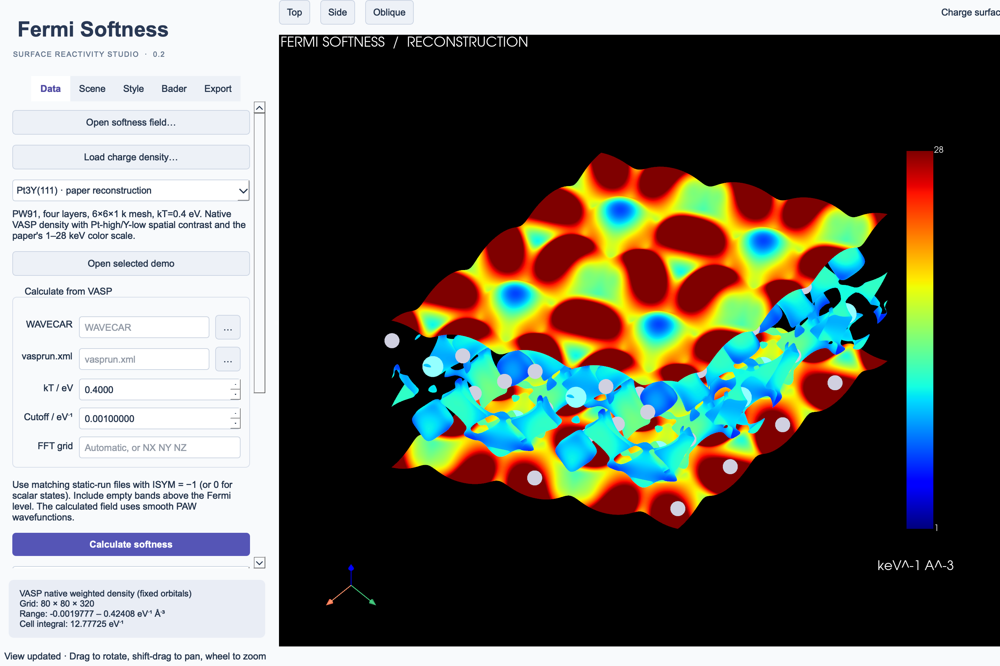

# Fermi Softness 0.2.1 — 完整使用手册

[English](user-guide.en.md) · [文档目录](index.md) · [命令行参考](cli-reference.zh-CN.md)

## 1. 软件用途

Fermi Softness 将 VASP 的电子态转换为描述表面反应性的局域费米软度，提供命令行、
Python API 和桌面图形界面 **Fermi Softness Studio**。方法来自 Huang、Xiao、Lu、
Zhuang 的 [2016 年论文](https://doi.org/10.1002/anie.201601824)。

[费米软度的来历](README.zh-CN.md#费米软度的来历)附有作者保存的 2016 年
ChemistryViews 报道截图。

软件可以计算三维软度场、观察周期性表面、进行 Bader 逐原子积分，并输出数值体数据
和高分辨率图像。当前版本是独立的 VASP 后处理程序。Fortran 目录提供可编译的累加
核心，尚不是针对某个 VASP 版本完成验证的源码插件。

## 2. 安装

要求 **Python 3.10 或更新版本**。本地 GUI 验证使用 macOS arm64 / Python 3.11；
原生密度算例使用 Linux 上的 VASP 6.4.2。仓库配置了其他系统和 Python 版本的 CI，
具体是否通过应查看实际运行结果，不能仅以存在配置文件作为验证依据。

克隆仓库，或者解压下载的源码包后进入其目录：

```sh
git clone https://github.com/zhuangl/Fermi_softness.git
cd Fermi_softness
python -m venv .venv
```

macOS / Linux 激活环境：

```sh
source .venv/bin/activate
```

Windows PowerShell 激活环境：

```powershell
.venv\Scripts\Activate.ps1
```

安装并启动：

```sh
python -m pip install --upgrade pip
python -m pip install ".[gui]"
fermi-softness --version
fermi-softness gui --example pt3y111
```

服务器只计算、不绘图时，使用 `python -m pip install .`。下载 wheel 后可使用
`python -m pip install "./fermi_softness-0.2.1-py3-none-any.whl[gui]"` 安装。
安装依赖可能需要联网；本项目没有假定软件已发布到 PyPI。安装完成后，内置示例
可以离线观看，也不需要安装 VASP。

macOS 用户可双击源码目录的 `Fermi Softness Studio.command`，它使用同目录下的
`.venv`。其他安装方式使用 `fermi-softness gui` 或 `python -m fermi_softness gui`。
Windows 也可直接运行 `.venv\Scripts\python.exe -m fermi_softness gui`，省去环境激活。

GUI 和图片渲染需要图形环境。Linux 可以使用桌面会话或配置好的 X/EGL/OSMesa。
普通 SSH 终端可以执行计算，但不一定能完成三维渲染。界面当前采用英文控件名称，
下文保留这些名称，方便逐项对应。

## 3. 先观看内置示例

```sh
fermi-softness demos
fermi-softness gui --example pt111
fermi-softness gui --example pt3y111
fermi-softness gui --example pt111-bader
fermi-softness gui --example analytic
```

在 GUI 的 **Data** 页选择数据集，再点击 **Open selected demo**。

| 示例 ID | 内容 | 数据含义 |
|---|---|---|
| `pt111` | VASP 原生 Pt(111) 软度场和电荷包络面 | 软件验证算例：PBE、三层、1×1、400 eV、4×4×1 k 网格；不是论文中的 Pt 模型 |
| `pt3y111` | 四层 PW91 Pt₃Y(111)、电荷和加密 Bader 分区 | VASP 重建算例，展示 Pt 高/Y 低反差并采用原论文显示设置 |
| `pt111-bader` | Pt 示例中一个表面原子的 Bader 贡献 | 同一个 Pt 数据集的原子区域选区 |
| `analytic` | 解析构造的 Pt/Y 风格表面 | 教学数据，不是 DFT 结果 |

Pt₃Y 示例采用原图的 1–28 keV⁻¹ Å⁻³ 色标。目前采样 Pt 位点约为 43 keV⁻¹ Å⁻³，
超过该色标上限，因此会出现饱和颜色。更换配色或色标范围不代表数值已与原稿一致。

## 4. 选择计算路线

| 路线 | 输入与额外计算 | 密度表示及适用体系 |
|---|---|---|
| `compute` | 匹配的 WAVECAR 和 vasprun.xml；不需额外 VASP 作业 | PAW 平滑赝波函数场；支持标量、共线自旋及旋量 |
| `prepare-parchg` → VASP → `compute-parchg` | 导出逐态密度，文件数可能很多 | VASP 原生增广价电子密度；支持非磁和共线自旋 |
| `prepare-frozen` → VASP → `compute-frozen` | 一次紧凑加权密度导出 | 同类原生密度构造；仅非磁标量体系，已在 VASP 6.4.2 验证 |

已有波函数的直接观察可从 `compute` 开始。非磁体系需要保留 VASP 电荷增广时，
紧凑路线能避免大量 PARCHG 文件；逐态 PARCHG 路线还可用于独立交叉检查。
两种原生路线都不等于完整的全电子轨道重建。比较不同材料时，应保持密度表示一致，
并分别确认 DFT 参数已经收敛。

## 5. 准备 VASP 源计算

先弛豫结构，再做收敛的静态计算。泛函、赝势、平面波截断、层数、真空和 k 点网格
应按实际体系选择。以下只列相关设置，不是一份适用于所有材料的完整 INCAR：

```text
NSW    = 0
IBRION = -1
LWAVE  = .TRUE.
LCHARG = .TRUE.
ISYM   = -1
PREC   = Accurate
LREAL  = .FALSE.
# 如果需要 Bader 分区参考密度：
LAECHG = .TRUE.
# NBANDS 必须覆盖费米软度所需能窗。
```

保留同一次源计算的 `WAVECAR`、`vasprun.xml`、`INCAR`、`POTCAR`、`CHGCAR`，
以及需要时生成的 `AECCAR0`、`AECCAR2`。不要混合不同几何结构或不同计算的输出。
同时保留 KPOINTS 和 OUTCAR 作为研究记录。POTCAR 由使用者在自己的合法 VASP
环境中准备，不随本软件分发。

标量计算也支持 `ISYM=0`；旋量计算要求 `ISYM=-1`。本版未实现一般空间群对称性
对不可约 k 点局域场的展开。普通 `ISYM=2` 结果需要采用合适的对称性设置重新计算。

默认描述符参数为 **kT = 0.4 eV**，与 SCF 展宽 `SIGMA` 分开设置。
默认绝对核函数阈值 **0.001 eV⁻¹** 对应约 **EF ± 3.1293 eV** 的能窗。
每个 k 点和自旋通道都必须包含足够的空带。软件检查能窗两端；若缺少高能空带，
增加 NBANDS 后重新进行静态计算。

## 6. 直接读取 WAVECAR

以下示例将原始 VASP 目录记作 `source-run/`：

```sh
fermi-softness inspect source-run/WAVECAR
fermi-softness compute --wavecar source-run/WAVECAR \
  --vasprun source-run/vasprun.xml --kt 0.4 --threshold 0.001 \
  -o smooth-softness
fermi-softness gui smooth-softness/softness.npz --charge source-run/CHGCAR
```

`inspect` 显示文件格式及推荐 FFT 网格。建议先自动选网格。手动指定
`--grid NX NY NZ` 时，必须通过密度混叠检查。加密网格只是更细地采样已有平面波函数，
不会提高 ENCUT，也不能恢复缺失的 PAW 增广。

直接计算逐态处理数据。`--max-memory-gb` 默认 4 GB，用于工作内存估算，不是操作
系统的进程内存硬上限。旧式 Gamma 文件若使用 z 半空间存储，需要 `--gamma-half z`；
默认采用 x 半空间。

GUI 对应操作：在 **Data** 中选择两个源文件，设置 **kT**、**Cutoff** 和可选的
**FFT grid**，点击 **Calculate softness**。这个按钮计算平滑赝波函数场。
下方显示进度，取消操作在当前处理单元完成后生效；计算完成后在 **Export** 保存。

## 7. VASP 原生密度路线

在独立目录运行密度导出，先阅读程序生成的 `RUN.md`。使用自己的 VASP 可执行文件
和常用作业调度方式。

### 非磁体系的紧凑导出

```sh
fermi-softness prepare-frozen --wavecar source-run/WAVECAR \
  --vasprun source-run/vasprun.xml --incar source-run/INCAR \
  --kt 0.4 -o compact-deck
cp source-run/WAVECAR source-run/POTCAR compact-deck/
# 按 compact-deck/RUN.md，在 compact-deck 中运行 VASP。
fermi-softness compute-frozen compact-deck/manifest.json -o native-softness
fermi-softness gui native-softness/softness.npz --charge source-run/CHGCAR
```

准备过程写入结构、显式 k 点、受控 INCAR、manifest 和运行说明。输入原 INCAR 是为了
保留泛函等相关设置，不要再用通用 SCF INCAR 覆盖生成文件。并行设置应保证 NBANDS
不变。固定轨道参数和临时占据数是导出所必需的，导入时会逐项检查。

导出目录的 CHGCAR 是数学上的加权密度，**不是基态电荷密度**。绘制 95% 电荷包络面
应使用原始 `source-run/CHGCAR`，Bader 边界应使用原始 AECCAR 文件。导出运行中的
能量、费米能和电子数不能解释为一次新的物理自洽计算结果。

### 逐态 PARCHG 导出

```sh
fermi-softness prepare-parchg --wavecar source-run/WAVECAR \
  --vasprun source-run/vasprun.xml --incar source-run/INCAR \
  --kt 0.4 -o parchg-deck
cp source-run/WAVECAR source-run/POTCAR parchg-deck/
# 按 parchg-deck/RUN.md，在 parchg-deck 中运行 VASP。
fermi-softness compute-parchg parchg-deck/manifest.json -o parchg-softness
```

生成设置包含 LPARD、LSEPB、LSEPK 和 KPAR=1。逐能带、逐 k 点文件应与 manifest
保存在一起；整个能窗合并成一个 PARCHG 不能代替逐态文件。支持 gzip 压缩的 PARCHG。

GUI 中先选择 **Native: state-resolved PARCHG** 或 **Native: compact fixed orbitals
(nonmagnetic)**，点击 **Prepare native VASP densities…**；在外部完成 VASP 运行后，
点击 **Combine native densities…**。GUI 本身不向计算集群提交作业。
详见[原生密度导出说明](native-export.zh-CN.md)。

## 8. Bader 逐原子及表面层分析

Bader 使用参考电荷密度的零通量面定义原子边界，再在这些体积内积分费米软度。
推荐使用原始 `AECCAR0+AECCAR2` 作为 VASP 分区参考；如果需要价电子数，另行提供
原始 CHGCAR。

```sh
fermi-softness install-bader
fermi-softness bader native-softness/softness.npz \
  --reference source-run/AECCAR0 source-run/AECCAR2 \
  --charge source-run/CHGCAR --surface-atoms 1 7 10 13 \
  -o atomic-softness
```

自动安装支持 macOS arm64 和 Linux x86_64，下载经过校验和验证的 Henkelman
Bader 1.05 程序。其他平台可编译官方源码，使用 `--executable /path/to/bader`
或环境变量 `FERMI_SOFTNESS_BADER` 指定可执行文件。默认安装位置为当前工作目录
下的 `.tools/bader`；从其他目录启动 GUI 时，显式选择路径更方便。

原子编号**从 1 开始**，按软度场保存的结构顺序排列。上面的 1、7、10、13 对应内置
Pt₃Y 顶层，不适用于所有表面。不提供 `--surface-atoms` 时只输出逐原子结果。
表面层结果是所选原子积分之和，不自动除以原子数或面积。

默认 `--vacuum off` 将所有网格点归入原子区域。`--vacuum auto` 允许 Bader 识别真空，
并单独报告其软度。参考密度和软度场必须具有一致的晶胞、原点与原子结构；若参考网格
更细，软件用周期 Fourier 插值将软度场采样到该网格，不会默默降低参考密度分辨率。
应通过进一步加密参考网格检查逐原子结果的收敛。

输出包括 `atoms.csv`、`report.json`、`basins.npz`、`softness-on-bader-grid.npz`，
以及 Bader 原始 `ACF.dat`、`AtIndex.dat` 和日志。软件检查原子贡献与真空贡献之和
是否守恒。价电子数不自动等于原子净电荷。

```sh
fermi-softness select-basins native-softness/softness.npz \
  --basins atomic-softness/basins.npz --atoms 1 7 10 13 \
  -o surface-only.npz
fermi-softness gui surface-only.npz --charge source-run/CHGCAR
```

在 GUI 的 **Bader** 页选择参考文件、程序和 **Output parent**，结果写入该父目录
下的 `bader-result`。点击 **Calculate atomic softness** 后，可在表格中选择原子，
使用 **View selected atom basins**、**View recorded surface layer** 或
**Restore full field** 切换显示。选区场在区域外为零，并带有明确选区标记；
Export 保存的是当前场。详见 [Bader 方法说明](bader.zh-CN.md)。

## 9. 在 Studio 中作图



内置 Pt₃Y 重建结果的实际桌面界面。Data、Scene、Style、Bader、Export 分别对应
数据、场景、样式、原子分析和导出。

1. 在 **Data** 打开 `softness.npz`；需要时加载原始电荷密度。
2. 在 **Scene** 选择显示方式，点击 **Apply view**。
3. 拖动旋转、Shift 加拖动平移、滚轮缩放；使用视角按钮或正交投影调整构图。
4. 在 **Style** 设置配色、颜色棒、范围、单位和背景。
5. 用 **Save view…** 保存场景，在 **Export** 导出图像。

| 控件 | 含义 |
|---|---|
| Softness isosurface / Softness level | 软度等值面；数值使用当前选择的 eV 或 keV 显示单位 |
| Charge surface · softness colors | 在电荷等值面上用颜色表示局域软度 |
| Enclosed charge | 默认 0.95；根据密度累积分布求包围 95% 电荷的阈值 |
| Charge level | 直接指定电荷等值面，单位 Å⁻³；填写后覆盖自动包络面阈值 |
| Planar section / Plane normal / Plane fraction | 选择 a/b/c 方向及分数位置的切片 |
| Supercell a b c | 周期性重复显示，不是重新计算超胞 |
| Cell view origin | 以分数坐标移动显示晶胞的切割位置 |
| Display stride | 为交互预览降低采样密度；最终出图建议设为 1 |
| Fit color range to visible surface | 自动色标；跨材料比较时关闭 |
| Orthographic projection | 正交投影，消除透视缩短 |

**Style** 提供 Scientific light（科研浅色）、Paper 2016（论文风格）、Presentation
dark（演示深色）和 Grayscale print（灰度打印）四套预设。颜色棒支持横向、纵向、
紧凑、仅两端刻度和隐藏；还可调字体、刻度数、数值格式和配色反转。Paper 2016
只改变绘图风格，不会把数据转换成论文结果，也不会替你确认数值色标范围。

局域软度以 eV⁻¹ Å⁻³ 保存。切换到 keV⁻¹ Å⁻³ 时，显示数值乘以 1000，原始数据
保持不变。软度等值面和颜色上下限随单位切换，电荷等值面仍使用 Å⁻³。
比较图应保持密度表示、kT、包络面定义、颜色范围及单位一致，并在图注中说明。

## 10. 导出图像与数值数据

在 **Export** 设置像素宽高、DPI 和可选透明背景，再点击 **Export PNG or TIFF…**。
例如 4800×3600 像素、600 DPI 对应 8×6 英寸。仅增加 DPI 不会产生更多图像细节；
实际像素数决定图像分辨率，计算网格则独立决定空间采样精度。

当前相机和显示设置会随图保存为 `figure.png.scene.json`，TIFF 也采用类似命名。
场景文件不包含数值场本身，应同时保留软度场和电荷输入。

```sh
fermi-softness render native-softness/softness.npz \
  --charge source-run/CHGCAR --scene view.json \
  --width 4800 --height 3600 --dpi 600 -o figure.png
```

`view.json` 来自 **Save view…**，图片旁边自动生成的 scene 文件也可使用。
不指定场景时采用默认显示设置。命令行可覆盖尺寸、DPI 和显示模式；更完整的配色、
相机参数通过场景文件传入。

**Save field (.npz)…** 保存几何结构、单位和元数据。**Export Cube for VMD / VESTA…**
输出可供外部软件读取的体数据。Cube 坐标采用 Bohr，标量单位写在注释中；导入第三方
Cube 时应确认单位，因为该格式没有统一强制的标量单位约定。定量交换优先使用 NPZ。

## 11. 理解并归档结果

| 文件或数值 | 含义 |
|---|---|
| `softness.npz` | 网格、晶胞、位置、元素、原点和 JSON 元数据 |
| `softness.cube` | 用于软件间交换的体数据 |
| `metadata.json` | 计算设置、密度表示、检查结果和数据来源 |
| `softness_up.npz`、`softness_down.npz` | 共线自旋计算中分别提供的自旋贡献 |
| 场的空间积分 | 整个晶胞的软度，单位 eV⁻¹ |
| 谱软度 | 电子态权重求和，单位 eV⁻¹ |
| 原子或选定表面层软度 | 对相应 Bader 体积积分，单位 eV⁻¹ |

平滑场缺少 PAW 增广，因此空间积分可能不同于谱软度。不要强制重新归一化波函数来
消除这一差异。原生密度路线检查积分一致性，但该检查不能代替 k 点、层数或截断能
收敛测试。原生 PAW 电荷增广在局部核区的数值，也不能直接视作完整重建的全电子
概率密度。

研究归档应包含软件版本、原始 VASP 输入输出、manifest、数值场、Bader 报告和场景
JSON。公开分享时不包含 VASP 源码和 POTCAR，本项目也不分发这些文件。
命令行结果写入会保护已有目标结果，重算时请选择新目录；GUI 保存对话框允许你确认
覆盖已有文件。

## 12. 常见问题

| 现象 | 处理方式 |
|---|---|
| 找不到 `fermi-softness` 命令 | 激活安装环境，或使用 `python -m fermi_softness`，确认 pip 和 Python 属于同一环境 |
| Qt/VTK 导入失败 | 在当前环境安装 `gui` 可选依赖 |
| 黑屏或图形上下文错误 | 使用可用的桌面或渲染后端；先打开内置示例以区分图形环境问题与数据问题 |
| 看不到等值面 | 选择数据范围内的阈值；电荷模式需加载电荷文件，并调整相机 |
| 能窗上界未覆盖 | 增加 NBANDS，重新进行源静态计算 |
| 拒绝缩减 k 点集合 | 使用 ISYM=-1 或支持的标量 ISYM=0 重新计算 |
| 文件不一致或未收敛 | 使用同一次收敛静态计算的输出，不使用 MD 外推 WAVECAR |
| FFT 网格被拒绝 | 使用推荐尺寸或更大网格，不绕过密度混叠检查 |
| 原生导出失败或 NBANDS 改变 | 按 RUN.md 操作，保留原 INCAR 相关设置，使用保持带数的并行布局；PARCHG 使用 KPAR=1 |
| 原生场积分不匹配 | 检查 WAVECAR 指纹、赝势、逐态文件和 manifest，不通过缩放隐藏差异 |
| 找不到 Bader 程序 | 安装或显式选择可执行文件，并检查所需编译器运行库 |
| Bader 几何或网格不匹配 | 使用同结构原始参考密度，并保证参考网格足够细 |
| 换数据后颜色含义改变 | 关闭自动色标，统一颜色范围和电荷包络面定义 |
| 内存占用过高 | 先减少显示重复次数、降低预览采样；区分最终数值精度与绘图分辨率 |

`--allow-incomplete` 和 `--allow-reduced` 只用于诊断，不会修复缺失空带或对称性展开。
输出会明确标记为诊断结果。提交问题时请参考[参与开发说明](../CONTRIBUTING.zh-CN.md)。

## 13. 验证与引用

在把示例当作论文复现之前，请阅读[验证记录](validation.zh-CN.md)。当前 Pt₃Y 通过
定性反差和内部一致性检查。原论文完整材料系列、
MoS₂ 边缘和吸附能关联尚未在本软件中逐项复现。

使用本软件或方法开展研究时，应引用 [2016 年原论文](https://doi.org/10.1002/anie.201601824)，
完整要求和 BibTeX 见[引用说明](../CITING.md)。同时注明
软件版本或 Git 提交号。计算记录应包括 kT、绝对核函数阈值、DFT 设置、密度表示、
Bader 参考与网格、图像色标。[CITATION.cff](../CITATION.cff) 提供文献信息，
[科学方法说明](science.zh-CN.md) 给出具体数值约定。
